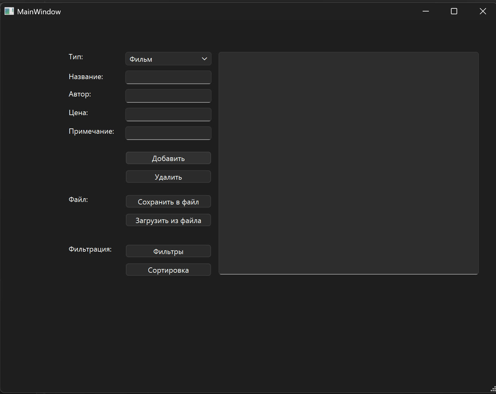
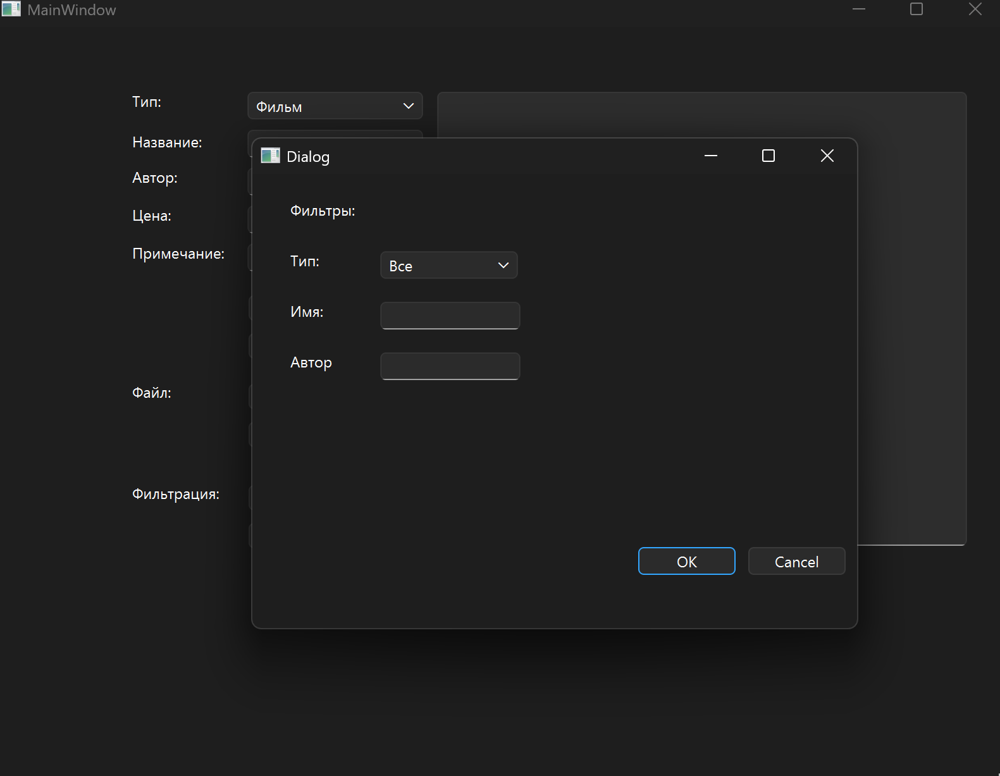
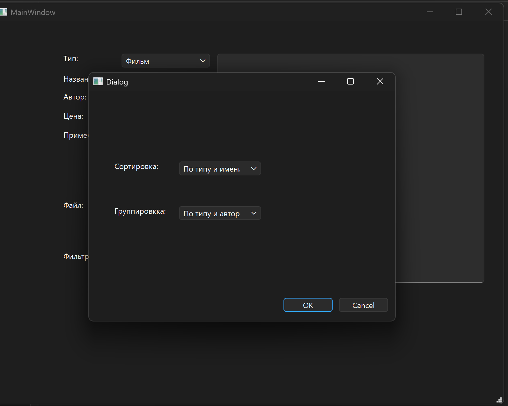

# 📀 Qt Shop Of DVD

Учебный проект на C++ с использованием Qt, реализующий систему учета CD/DVD дисков в магазине.

---

## 📌 Описание

Приложение позволяет работать со списком дисков (фильмы, музыка, ПО и др.), включая:

* хранение информации в файле
* поиск, сортировку и группировку данных
* работу через графический интерфейс

Проект разработан в рамках университетского задания.

---

## ⚙️ Функционал

### 📋 Управление данными

* ➕ Добавление дисков
* ❌ Удаление записей
* ✏️ Редактирование информации
* 📄 Просмотр списка

### 🔍 Поиск

* По автору
* По названию

### 🔃 Сортировка

* По названию
* По автору
* Внутри каждого типа

### 📊 Группировка

* По типу (фильм, музыка, софт и т.д.)
* По автору

---

## 🧱 Структура данных

Каждый диск содержит:

* Тип (фильм / музыка / софт)
* Название
* Автор
* Цена
* Примечание

---

## 🖥️ Интерфейс

Приложение использует Qt Widgets:

* Main Window — основное окно
* Dialog окна:

  * поиск (`SearchDialog`)
  * сортировка и группировка (`SortGroupDialog`)

---

## 🛠️ Технологии

* C++
* Qt (Qt Widgets)
* QFile / FileStream
* ООП (классы и динамические массивы)

---

## 📂 Структура проекта

```
.
├── main.cpp
├── mainwindow.*
├── disk.*
├── searchdisk.*
├── sortgroupdialog.*
├── *.ui
└── ShopOfDvd.pro
```

---

## ▶️ Запуск проекта

1. Установить Qt Creator
2. Открыть файл:

   ```
   ShopOfDvd.pro
   ```
3. Нажать **Run**

---

## 💾 Работа с данными

* Данные сохраняются в файл
* Используются методы загрузки и сохранения
* Поддерживается чтение/запись

---

## 📚 Учебные цели проекта

* Работа с файлами в C++
* Использование Qt GUI
* Реализация ООП
* Сортировка, поиск, группировка данных

---


## 🚀 Возможные улучшения

* Добавить базу данных (SQLite)
* Улучшить UI/UX
* Добавить фильтры
* Экспорт/импорт данных

---

## 🖥️ Интерфейс приложения

### Главное окно


### Поиск


### Сортировка и группировка


